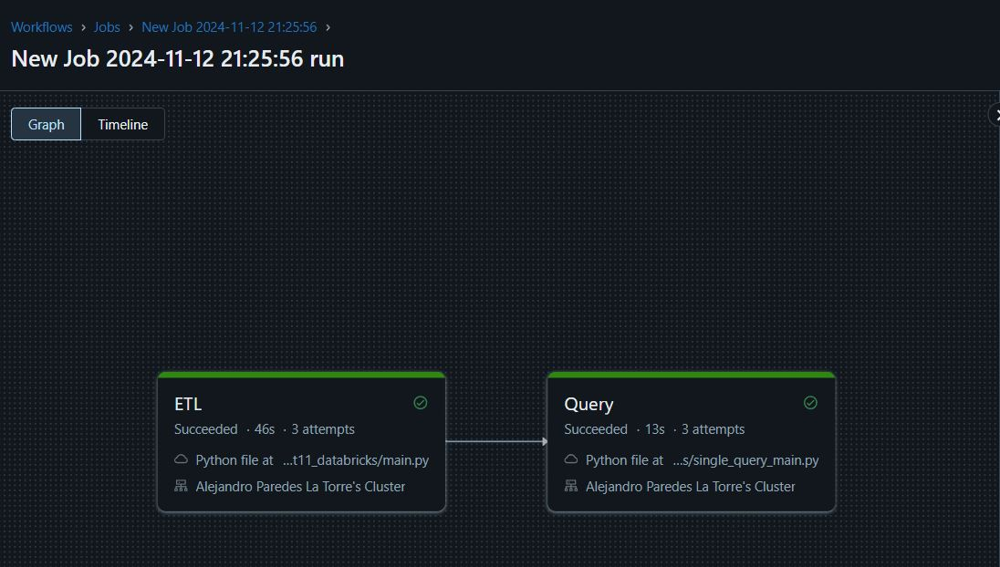

---

# IDS706_AlejandroParedesLaTorre_Assignment11_Databricks

Data Pipeline with Databricks

The primary purpose of this project is to design and develop an efficient data pipeline using Databricks. This pipeline should integrate data sources and destinations, emphasizing the designer's ability to perform extraction, transformation, and loading (ETL) tasks effectively. The focus is on ensuring the efficiency and scalability of the pipeline, along with the proper configuration of data sources and destinations.

This repository provides an ETL pipeline using PySpark within Databricks to extract data from an external API, transform it for analysis, and load it into a Databricks Delta table.

Dataset
The data is extracted from the API:
[Universities API](http://universities.hipolabs.com/search?country=United+States)
This dataset, in JSON format, contains basic information about universities in the United States.

🛠️ Project Workflow Steps
The steps carried out to execute this project are:
### Step 1: Create a cluster


### Step 2: Import the github repo:


### Step 3: Perform the ETL:
The ETL architecture is presented below:

1. **Extract**: Fetch data from the API.
2. **Transform**: Clean and structure data with PySpark, exploding and concatenating fields to create unique records.
3. **Load**: Insert transformed data into a Delta table in Databricks, enabling efficient querying and further analysis with Spark SQL.


### Step 2: Run the job for the ETL and the Query:



## Project Overview

The main components of this project include:

- **ETL Pipeline**: Extracts university data, transforms it using PySpark to create a structured format, and loads it into a Delta table in Databricks for SQL querying and analysis.
- **Spark SQL Query Module (`query_sql`)**: Provides an interface to perform SQL queries on the transformed data stored in Databricks.

## Files and Directories

- `ETL.py`: Main Python script containing the ETL pipeline to extract, transform, and load data.
- `Makefile`: Defines commands to streamline setup and execution processes.
- `Dockerfile`: Contains instructions for creating a Docker image to ensure consistent runtime environments.
- `requirements.txt`: Specifies necessary Python packages, including PySpark.
- `.github/workflows/`: Contains GitHub Actions workflows to automate testing and deployment.
- `.devcontainer/`: Configuration for GitHub Codespaces to set up a reproducible development environment.

## Purpose

The primary objective of this project is to demonstrate data handling using an ETL process with PySpark in a Databricks environment. This project serves as a foundational example for handling, transforming, and managing data in a distributed environment, taking advantage of Databricks' scalability.

## Architecture

The ETL architecture is presented below:

1. **Extract**: Fetch data from the API.
2. **Transform**: Clean and structure data with PySpark, exploding and concatenating fields to create unique records.
3. **Load**: Insert transformed data into a Delta table in Databricks, enabling efficient querying and further analysis with Spark SQL.

## Getting Started

### 1. Set Up in Databricks

- Clone the repository to a Databricks environment or import the `ETL.py` file into a Databricks notebook.

### 2. Install Requirements

Run the following to ensure dependencies are available:
```bash
pip install -r requirements.txt
```

### 3. Initialize the ETL Pipeline

Once set up, you can initiate the ETL pipeline in Databricks. Each step of the pipeline is logged to ensure traceability and transparency of operations.

## Running the Project

1. **Extract Data**: The ETL script fetches data from the Universities API.
2. **Transform Data**: Data transformations are performed in PySpark, including exploding lists and creating unique IDs.
3. **Load Data**: Transformed data is loaded into a Delta table in Databricks for further analysis and SQL querying.

## Querying Data

The `query_sql` module enables you to run SQL queries on the Delta table. For example, you can run:
```python
etl = ETL()
etl.extract()
etl.transform()
etl.load("aplt_universities")
etl.spark_sql_query("SELECT * FROM aplt_universities LIMIT 10")
```

This project demonstrates PySpark’s capabilities for handling large-scale data processing within Databricks, showcasing how to implement an ETL pipeline and query the data using Spark SQL.

## License

This project is licensed under the MIT License. See the LICENSE file for details. 

---